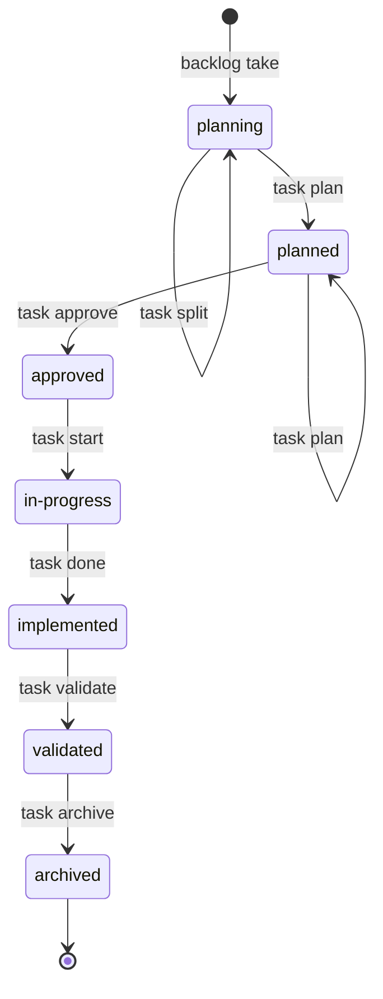

# Lifecycles

Developer reference for the state machines and setup sequences in `itr`.

---

## 1. Backlog Item Lifecycle

Backlog item state is **calculated** — no state field is stored in the item's YAML. State is derived from the tasks linked to the item.

### States

| State | Meaning |
|---|---|
| `unstarted` | No tasks exist for this backlog item. |
| `in-progress` | At least one task exists and not all tasks are archived. |
| `done` | All linked tasks are archived. |

### How state is derived

```
tasks for item = []           → unstarted
tasks for item = [...] AND
  any task NOT archived       → in-progress
all tasks archived            → done
```

---

## 2. Task Lifecycle

A task is created when a backlog item is taken with `backlog take`. Each task is scoped to exactly one repo. A backlog item with multiple repos produces one task per repo.

### States

| State | Meaning |
|---|---|
| `planning` | Task created, no plan artifact exists yet. |
| `planned` | A plan artifact exists. Re-runnable — `task plan` updates the plan without changing state. |
| `approved` | Plan has been explicitly signed off. Ready to begin implementation. |
| `in-progress` | Active implementation underway in the scoped repo. |
| `implemented` | Dev work complete. Branch exists and work is done. |
| `validated` | Explicitly validated and accepted. Completion checks have passed. |
| `archived` | Moved to `TASKS/archive/`. Historical record only. |

### Transitions

| From | Command | To | Guard |
|---|---|---|---|
| _(backlog item taken)_ | `backlog take` | `planning` | Repos exist in product config |
| `planning` or `planned` | `task split` | _(replaced by new tasks)_ | Task not yet approved |
| `planning` | `task plan` | `planned` | — |
| `planned` | `task plan` | `planned` | Re-runnable. Creates or updates plan artifact. |
| `planned` | `task approve` | `approved` | Plan artifact must exist |
| `approved` | `task start` | `in-progress` | — |
| `in-progress` | `task done` | `implemented` | — |
| `implemented` | `task validate` | `validated` | Completion checks must pass |
| `validated` | `task archive` | `archived` | Task state must be `validated` |

### Diagram



---

## 3. Portfolio and Product Setup

This is a setup sequence, not a state machine. The commands below initialise the system from nothing to a fully resolved product context.

### Config location resolution

The portfolio config path is resolved in order:

1. `$ITR_HOME/portfolio.json` — if `ITR_HOME` is set and non-empty
2. `~/.config/itr/portfolio.json` — default fallback

### Profile selection precedence

When resolving the active profile, the following order applies (first match wins):

1. `--profile` CLI flag
2. `ITR_PROFILE` environment variable
3. `defaultProfile` field in `portfolio.json`
4. Error — `ProfileNotFound`

### Coordination root modes

A product's `.itr/` directory is located by appending `/.itr` to the configured root path, regardless of mode. The `mode` field is semantic — it communicates intent but does not change path resolution in MVP.

| Mode | Config field | `.itr/` expected at |
|---|---|---|
| `standalone` | `dir` | `<dir>/.itr/` |
| `primary-repo` | `repoDir` | `<repoDir>/.itr/` |
| `control-repo` | `repoDir` | `<repoDir>/.itr/` |

### Setup sequence

```
1. itr settings bootstrap    Create ~/.config/itr/portfolio.json if missing
2. itr profile add           Register a profile (e.g. work, personal)
3. itr product init          Initialise a product and its .itr/ directory
4. itr product register      Register an existing product into the active profile
```

After setup, every command that operates on a product follows the same resolution pipeline:

```
loadPortfolio
  >>= resolveActiveProfile   (flag → env → default)
  >>= resolveProduct         (validates .itr/ exists on disk)
  >>= executeProductCommand
```

No entry point duplicates this logic.
